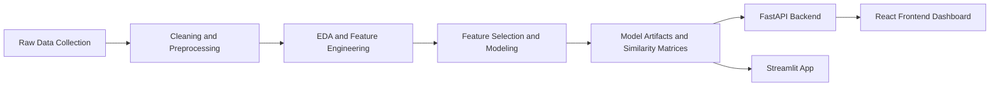

# Gurgaon Real Estate Intelligence Platform

A complete end-to-end real estate analytics project focused on Gurgaon properties.

This repository contains:
- A machine learning pipeline for price prediction
- A FastAPI backend for model inference and analytics APIs
- A React frontend dashboard for valuation, analysis, and recommendations
- A Streamlit app version retained for reference and experimentation

## Table of Contents

- [Overview](#overview)
- [Core Features](#core-features)
- [Repository Structure](#repository-structure)
- [Architecture](#architecture)
- [Tech Stack](#tech-stack)
- [Data Science Workflow](#data-science-workflow)
- [API Reference](#api-reference)
- [Getting Started](#getting-started)
- [How to Run the Full Project](#how-to-run-the-full-project)
- [Model and Data Artifacts](#model-and-data-artifacts)
- [Troubleshooting](#troubleshooting)
- [Future Improvements](#future-improvements)
- [License](#license)

## Overview

The Gurgaon Real Estate Intelligence Platform is designed to help users:
- Estimate property prices using a trained machine learning model
- Analyze market behavior using interactive visual analytics
- Discover similar apartments and nearby properties for recommendation use cases

It combines data collection, preprocessing, feature engineering, model training, and production-style app integration in one repository.

## Core Features

### 1) Price Prediction
- Predicts property price range in crores (Cr)
- Supports flat and house types
- Uses structured property inputs such as sector, BHK, area, furnishing, floor category, and luxury category

### 2) Market Analytics
- Sector-level statistics (price, price per sqft, built-up area)
- Area vs price analysis
- Bedroom distribution analysis
- Feature text analytics endpoint for word-cloud style exploration

### 3) Recommendation Engine
- Nearby property search by location and radius
- Similar apartment recommendations based on weighted cosine similarity matrices

### 4) Dual App Interface
- React dashboard for modern web UI
- Streamlit app for quick exploration and legacy compatibility

## Repository Structure

```text
real_estate_project/
├── backend/                      # FastAPI backend
│   ├── app/
│   │   └── main.py
│   └── requirements.txt
├── frontend/                     # React + Vite frontend
│   ├── src/
│   │   ├── App.jsx
│   │   ├── main.jsx
│   │   └── styles.css
│   ├── package.json
│   └── vite.config.js
├── streamlit_app/                # Streamlit application and model artifacts
│   ├── Home.py
│   ├── pipeline.pkl
│   ├── datasets/
│   └── pages/
├── data_collection/
├── data_cleaning_pipeline/
├── data_preprocessing/
├── exploratory_data_analysis/
├── feature_engineering/
├── feature_selection/
├── modelling/
├── recommender_system/
├── visualization/
├── intermediate_datasets/
├── cleaned_datasets/
└── docs/images/
```

## Architecture



## Tech Stack

### Backend
- FastAPI
- Uvicorn
- Pandas
- NumPy
- Scikit-learn

### Frontend
- React 18
- Vite
- Plotly (react-plotly.js)

### Data Science
- Jupyter Notebooks
- Pandas / NumPy
- Scikit-learn

## Data Science Workflow

The notebooks are organized by stage:

1. Data Collection
	- Collect and consolidate flats, houses, and apartment location data
2. Data Cleaning
	- Handle missing values and outliers
3. Data Preprocessing
	- Merge and standardize flat and house datasets
4. Exploratory Data Analysis
	- Univariate and multivariate analysis
5. Feature Engineering and Selection
	- Build and refine predictive feature set
6. Modeling and Selection
	- Train baseline and improved models
7. Recommendation Preparation
	- Build similarity matrices and location intelligence assets

## API Reference

Base URL (local): `http://localhost:8000`

### Health and Metadata
- `GET /` -> API status message
- `GET /api/health` -> health check
- `GET /api/metadata/options` -> dropdown values for frontend forms

### Prediction
- `POST /api/predict`
  - Input: property details payload
  - Output: `base_price`, `low`, `high`, `unit`

### Analytics
- `GET /api/analytics/sector-stats`
- `GET /api/analytics/feature-text`
- `GET /api/analytics/area-vs-price?property_type=flat|house`
- `GET /api/analytics/bedroom-pie?sector=overall|<sector_name>`

### Recommendations
- `GET /api/recommend/options`
- `GET /api/recommend/nearby?location=<name>&radius_km=<value>`
- `POST /api/recommend`

## Getting Started

## Prerequisites

- Python 3.10+
- Node.js 18+
- npm

## Backend Setup

From `backend/`:

```bash
pip install -r requirements.txt
uvicorn app.main:app --reload --port 8000
```

Backend runs at `http://localhost:8000`.

## Frontend Setup

From `frontend/`:

```bash
npm install
npm run dev
```

Frontend runs at `http://localhost:5173` by default.

Optional API base URL override:

```bash
# frontend/.env
VITE_API_BASE_URL=http://localhost:8000
```

## Streamlit App (Optional)

From repository root:

```bash
streamlit run streamlit_app/Home.py
```

## How to Run the Full Project

1. Start backend server from `backend/`
2. Start frontend dev server from `frontend/`
3. Open frontend URL in browser and test:
	- Valuation module
	- Analytics module
	- Recommendations module

## Model and Data Artifacts

Key runtime artifacts used by API and apps:
- `streamlit_app/pipeline.pkl` -> trained prediction pipeline
- `streamlit_app/df.pkl` (optional) -> preprocessed dataframe cache
- `streamlit_app/datasets/data_viz1.csv` -> analytics dataset
- `streamlit_app/datasets/feature_text.pkl` -> feature corpus for text analytics
- `streamlit_app/datasets/cosine_sim1.pkl` -> recommendation similarity matrix 1
- `streamlit_app/datasets/cosine_sim2.pkl` -> recommendation similarity matrix 2
- `streamlit_app/datasets/cosine_sim3.pkl` -> recommendation similarity matrix 3
- `data_collection/appartments.csv` -> location advantages source data

## Troubleshooting

- If prediction fails with model artifact errors:
  - Ensure `streamlit_app/pipeline.pkl` exists
- If recommendation endpoints fail:
  - Ensure cosine similarity files exist in `streamlit_app/datasets/`
- If frontend cannot reach backend:
  - Verify backend is running at port `8000`
  - Set `VITE_API_BASE_URL` in frontend `.env` if needed

## Future Improvements

- Add automated tests for API endpoints and model I/O contracts
- Add Docker setup for one-command deployment
- Improve recommendation explainability and ranking transparency
- Add CI pipeline for linting, tests, and artifact checks
- Replace placeholder preview image with real UI screenshots

## License

This project is licensed under the terms of the LICENSE file in this repository.
